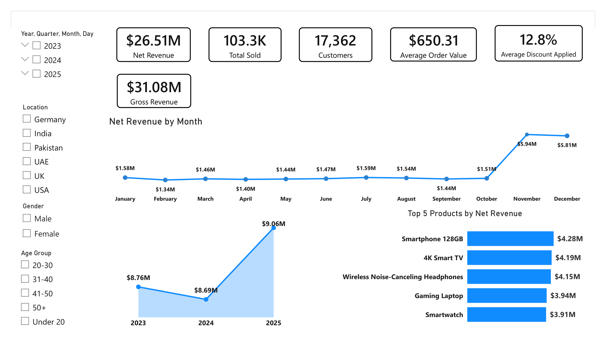
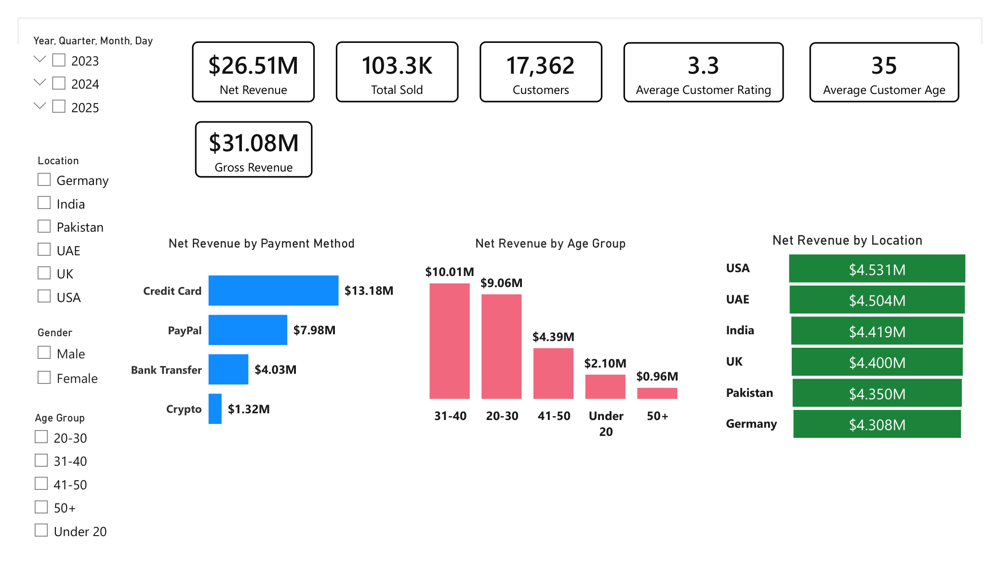

# e-commerce data dashboard (Power BI)
Analyze e-commerce data and revenue performance across the world

## Dataset
- [e-commerce_data.csv](dataset/ecommerce_data.csv)

## KPIs
- Net Revenue
- Total Sold
- Customers
- Average Order Value
- Average Discount Applied
- Gross Revenue
  
## Slicers
 - Date
 - Location
 - Gender
 - Age Group
 
## Tools Used
- Power BI
- DAX
- Excel / CSV

## Dashboard

### Business Overview

### Customer Analysis

